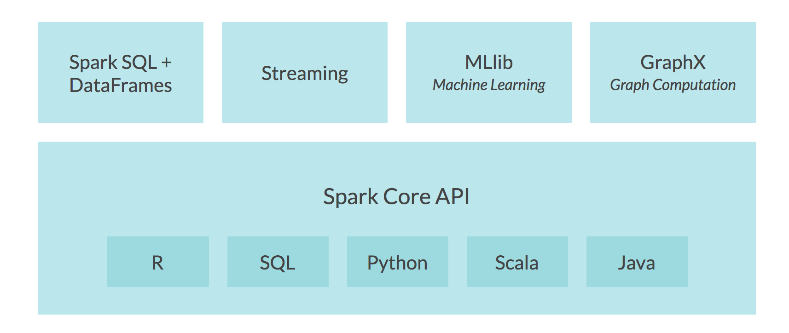

# learning-hadoop-and-spark

Companion Repository to Linked In Learning Courses. See folder `notebooks` for examples.
- Learning Hadoop
- Scaling Cloud Spark  

Original `Learning Hadoop` - [link to course](https://www.lynda.com/Hadoop-tutorials/Hadoop-Fundamentals/191942-2.html)

---

## Apache Spark Architecture

Compare Apache Spark to Databricks - https://databricks.com/spark/comparing-databricks-to-apache-spark  

---

## Sample code for Spark

### SELECT an example job:
- CalcPi
    - calculates the digits of Pi using PySpark to create a Spark job
    - takes an input parameter to indicate number of iterations, i.e. 10, 100, 1000...
    - demonstrates a distribute Spark compute job
    - takes no input data
    - prints results, i.e. `Pi is 3.14....`
- WordCount
    - performs a distributed Spark job which counts the word in an input text file
    - use any of the `shakespeare.raw` etc text files as input
    - produces a word count list as output
    - output location is configurable as a job parameter

---

### Use an execution language | environment:
- **Java**
    - Java file must be compiled to .jar files to run on the cluster
    - GCP Dataproc includes example .jar files on the VM image
- **Scala**
    - Scala file must be compiled to .jar files to run on the cluster
    - GCP Dataproc includes example .jar files on the VM image
- **PySpark**
    - Note if you cluster is running Python2 or Python3 when running your script
    - Integrated into GCP BigQuery interface (use PySpark) - [link](https://cloud.google.com/blog/products/data-analytics/spark-jobs-that-autoscale-and-made-seamless-for-all-data-users)
- **Jupyter-style Notebooks**
    - AWS EMR | GCP Dataproc use standard **Jupyter Notebooks**
    - Databricks on AWS | Azure uses **Databricks Notebooks**
        - These notebooks have additional, custom metadata (in addition to standard Jupyter metadata)
        - You can import/export PySpark files as Databricks Notebooks for interop
        - Link to additional example of Databricks Spark Jupyter notebooks is [here](https://github.com/dennyglee/databricks) or [here](https://databricks.com/resources?_sft_resource_type=example-notebook#databricks-jump-start)
 - **Koalas for Apache Spark**
     - Implements the pandas DataFrame API on top of Apache Spark - [link](https://github.com/databricks/koalas)
     - pandas is often used for single-node DataFrame implementations in Python
     - Spark is usually used for big data processing. With koalas you can:
         - Be immediately productive with Spark, with no learning curve, if you are already familiar with pandas.
         - Have a single codebase that works both with pandas (tests, smaller datasets) and with Spark (distributed datasets).
 - **Spark on Kubernetes (K8)**
    - 3 part series on Dev.to on using PySpark with K8 - [link](https://dev.to/psclgllt/series/12135)
